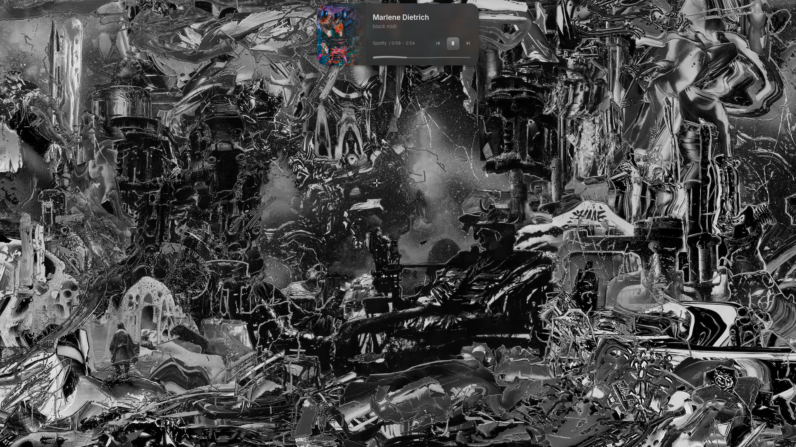

<div align="center">

# xiu

**An aesthetic, minimal, high-performance Wayland desktop environment.**
*Built on Hyprland, driven by Quickshell, engineered with Rust.*

<br />



<br />

---

</div>

## Overview

**xiu** is a modern, unified Wayland desktop environment designed for fluidity, precision, and visual cohesion. Rather than a loose collection of disparate scripts and themes, xiu couples a modular Hyprland compositor configuration with an interactive Quickshell floating status pill and a dedicated, pure Rust system engine (`xiu`).

Every component—from terminal emulators and file managers to application dialogs, system monitors, and web browsers—adapts seamlessly to your desktop wallpaper through an automated dynamic palette pipeline.

---

## Key Features

### 1. The Morphing Pill Shell & Lock Screen
Everything on the desktop interface is rendered natively in Quickshell:
- **Interactive Morphing Pill**: A compact, floating pill bar anchored to the top of your screen that expands on demand into dedicated control surfaces:
  - **App Launcher**: Subsequence and fuzzy matching across installed applications, with built-in commands (`>calc` expression solver, `>install` AppImage installer, `>wallpaper` switcher, and more).
  - **Clipboard History**: Visual clipboard manager with per-item pinning, direct removal, manual item rearrangement, and automatic session-cleanup preserving pinned items.
  - **Hardware Mixer & Quick Controls**: Volume, input devices, display brightness, Wi-Fi network selection, and Bluetooth peripherals.
  - **Media & Spectrum Visualizer**: Media controls coupled with reactive, audio-synchronized Cava spectrum bars.
  - **System Monitor & Settings**: In-shell configuration for idle timeouts, key chords, theme modes, and user profile management without manually editing configuration files.
- **Frosted Lock Screen**: Centered clock, circular profile picture (AccountsService or `~/.face`), PAM authentication with password masking, keyboard layout indicator, and integrated media visualizer.
- **Rishot Integration**: Integrated screenshot and annotation suite that matches your active desktop color theme.

### 2. Pure Rust Engine (`xiu-cli`)
The heart of xiu is a unified, high-performance command-line engine written in pure Rust (`xiu`):
- **Dynamic Theming**: Native Material You color extraction from wallpapers, rendering matching palettes for the shell, terminals, editors, and applications.
- **Window Management & PiP**: Built-in PiP snapping daemon reading Hyprland socket events for floating video windows.
- **File Chooser Bridge**: Integrated terminal file chooser wrapper (`xiu yazi-chooser`) connecting XDG desktop portals to Yazi.
- **System Health Checks**: `xiu check` verifies palette health, package dependencies, and portal integrity.
- **Shell Control & Updates**: `xiu shell`, `xiu status`, `xiu log`, and `xiu update` provide seamless lifecycle management.

### 3. Layout-Independent Raw Keybindings
- Bindings are defined on physical evdev keycodes (`code:NNN`), ensuring identical physical keyboard positions across multiple layouts (such as `us` and `ir(winkeys)`).
- Workspaces are grouped in sets of ten, featuring dedicated workspaces for stashed windows (`Super+S`), private workspaces (`Super+Alt+P`), and minimized application sets.

### 4. Cohesive Dynamic Theming Pipeline
Whenever you change your wallpaper via the wallpaper surface or `xiu wallpaper`, the system extracts color harmonies and applies them in real time across:
- **Terminals**: Foot and Ghostty
- **File Managers**: Yazi with custom rounded styling and modern statusline
- **Editors**: Neovim, Helix, Micro, and Zed (with Vesper-based dynamic palettes)
- **Audio & Media**: Spicetify (custom `xiu` theme), Cava
- **System Monitors**: btop, htop, nvtop, bottom
- **Messaging & Communication**: Vesktop / Vencord / Equicord, Telegram Desktop
- **Web Browsers**: Firefox and Zen (via native messaging extension and userChrome), Chromium/Brave policies
- **Desktop Toolkits**: GTK (via adw-gtk3) and Qt (via qtengine)

---

## Desktop Stack

| Component | Technology | Description |
|---|---|---|
| **Compositor** | Hyprland | Dynamic tiling Wayland compositor configured in modular Lua |
| **Shell & UI** | Quickshell (Qt 6 / QML) | Custom floating morphing pill, surfaces, and lock screen |
| **System CLI** | Rust (`xiu`) | Unified daemon, theming engine, and control utility |
| **Primary Terminal** | Foot | Ultra-fast, lightweight Wayland-native terminal emulator |
| **Shell Environment** | Fish | Interactive shell with custom prompt and automated aliases |
| **File Manager** | Yazi | Terminal file manager integrated into XDG portal dialogs |
| **Theming** | Matugen / Rust Engine | Dynamic Material You palette generation |
| **Screenshots** | Rishot | Wayland screenshot tool with interactive annotations |

---

## Keybindings Reference

All key combinations utilize raw keycodes, preserving identical physical layout regardless of active keyboard language. `Super` corresponds to the Windows/Command key.

### System & Session
| Key Chord | Action |
|---|---|
| `Super` + `Space` | Toggle application launcher |
| `Alt` + `Shift` | Switch keyboard layout (`us` ⇄ `ir`) |
| `Super` + `L` | Lock screen |
| `Super` + `Shift` + `L` | Suspend / sleep system |
| `Super` + `K` | Peek status pill |
| `Super` + `N` | Notification center |
| `Ctrl` + `Alt` + `C` | Clear all notifications |
| `Ctrl` + `Alt` + `Del` | Power / session menu |
| `Ctrl` + `Super` + `Alt` + `R` | Restart Quickshell instances |

### Window Management
| Key Chord | Action |
|---|---|
| `Super` + `Q` | Close active window |
| `Super` + `F` | Toggle fullscreen |
| `Super` + `Alt` + `F` | Toggle maximize |
| `Super` + `Alt` + `Space` | Toggle floating mode |
| `Super` + `P` | Pin floating window across workspaces |
| `Super` + `Alt` + `\` | Toggle Picture-in-Picture mode |
| `Ctrl` + `Super` + `\` | Center active floating window |
| `Super` + Arrow Keys | Change focus in direction |
| `Super` + `Shift` + Arrow Keys | Move active window in direction |
| `Super` + `-` / `Super` + `=` | Decrease / increase window width |
| `Super` + `Shift` + `-` / `=` | Decrease / increase window height |
| `Super` + `,` | Group windows into tabbed container |
| `Super` + `U` | Ungroup / extract window from container |
| `Alt` + `Tab` / `Shift` + `Alt` + `Tab` | Cycle next / previous window |

### Workspaces
| Key Chord | Action |
|---|---|
| `Super` + `1` – `0` | Switch to workspace 1–10 (current group) |
| `Super` + `Alt` + `1` – `0` | Move active window to workspace 1–10 |
| `Ctrl` + `Super` + `1` – `0` | Switch workspace group 1–10 |
| `Super` + Mouse Wheel | Navigate workspaces |
| `Super` + `S` | Toggle scratchpad / stash workspace |
| `Super` + `Shift` + `S` | Move active window to scratchpad |
| `Super` + `Alt` + `P` | Toggle private workspace |
| `Ctrl` + `Super` + `M` | Open minimized window tray |
| `Ctrl` + `Shift` + `Esc` | Jump to system monitor workspace |
| `Super` + `M` | Jump to or toggle Music workspace (Spotify) |
| `Super` + `A` | Jump to or toggle Communication workspace |
| `Super` + `J` | Jump to or toggle Telegram workspace |

### Applications & Tools
| Key Chord | Action |
|---|---|
| `Super` + `Return` | Launch Foot terminal |
| `Super` + `E` | Open file manager (Yazi) |
| `Super` + `W` | Open primary web browser |
| `Super` + `C` | Open code editor |
| `Super` + `V` | Open clipboard history surface |
| `Super` + `.` | Open emoji selector surface |
| `Super` + `B` | Shuffle wallpaper and regenerate theme |
| `Super` + `Shift` + `B` | Open interactive wallpaper selector surface |
| `Super` + `G` | Toggle Game Mode (disables animations and effects) |
| `Ctrl` + `Alt` + `V` | Open audio/brightness mixer surface |
| `Print` / `Shift` + `Print` | Interactive screenshot / region selection (Rishot) |

---

## Installation

### Automatic Installer
Clone and run the interactive installer on any supported Linux distribution (Arch Linux, Fedora, Debian, openSUSE, Gentoo):

```sh
git clone https://github.com/yrpcaro/xiu.git
cd xiu
python3 installer/xiu_install.py
```

Or install via one-line bootstrap:

```sh
curl -fsSL https://raw.githubusercontent.com/yrpcaro/xiu/main/install.sh | bash
```

### Installation Flags
```
--quickstart    Install core components with defaults without interactive prompts
--full          Install full suite including optional applications
--sddm          Deploy the Torii SDDM login theme
--no-deps       Skip distro package installation, only deploy configurations
--dry-run       Simulate installation steps without writing changes
--uninstall     Cleanly remove deployed configurations and binaries
```

### NixOS (Home-Manager)
For NixOS users managing their configuration with `home-manager`:

```nix
imports = [ /path/to/xiu/nix/home-manager.nix ];

programs.xiu = {
  enable = true;
  repo = /path/to/xiu;
};
```

---

## Architecture & Repository Layout

```
xiu/
├── cli/                        # Native pure Rust system engine (xiu binary)
│   ├── src/commands/           # Resizer daemon, wallcolors, yazi-chooser, shell IPC
│   └── tests/                  # Integration test suite
├── configs/
│   ├── hypr/                   # Hyprland modular Lua configurations & window rules
│   ├── quickshell/             # Quickshell pill, surfaces, launcher, and lock screen
│   │   ├── pill/               # Morphing pill, widgets, and IPC handlers
│   │   ├── lock/               # Lock screen surface and shaders
│   │   └── rishot/             # Screenshot and annotation UI
│   ├── yazi/                   # Yazi file manager configurations and plugins
│   ├── foot/                   # Foot terminal configuration
│   ├── spicetify/              # Spotify xiu theme templates
│   ├── portals/                # XDG desktop portal configurations
│   └── xdg-desktop-portal-termfilechooser/ # Terminal file picker configuration
├── installer/                  # Python installer, distro abstraction, and deployer
└── tests/                      # Multi-suite automated test harnesses
```

---

## Testing & Quality Assurance

xiu includes a comprehensive test suite across the Rust CLI, Python deployment scripts, and JavaScript/QML modules:

```sh
# Run full 14-suite verification
(cd cli && cargo test --quiet) && \
python3 configs/hypr/scripts/test_default_apps.py && \
python3 configs/hypr/scripts/test_wallcolors.py && \
python3 configs/hypr/scripts/test_xiu_update.py && \
python3 configs/hypr/scripts/test_resizer.py && \
bash configs/hypr/scripts/test_launch_guard.sh && \
python3 installer/fallbacks.py && \
python3 installer/deploy.py && \
python3 installer/distro.py && \
node configs/quickshell/launcher/lib/fuzzy.test.mjs && \
node configs/quickshell/pill/lib/keychord.test.mjs && \
node configs/quickshell/pill/lib/monitors.test.mjs && \
node configs/quickshell/pill/lib/commands.test.mjs && \
(cd configs/quickshell/rishot/lib && ./run-tests.sh)
```

---

## License

This project is licensed under the MIT License. See [LICENSE](LICENSE) for details.
